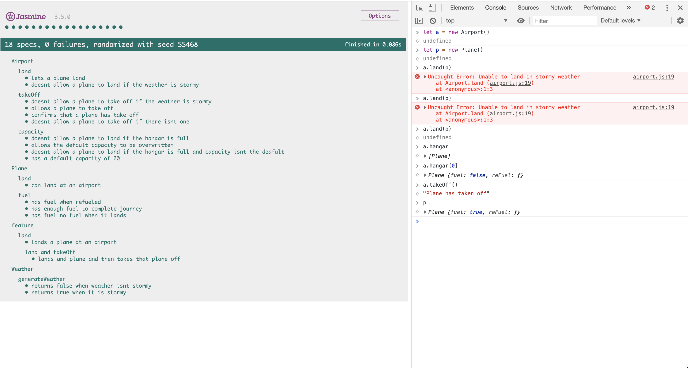

# airport-javascript

## Overview

Simple JavaScript app that is run in the console to emulate an airport.

## User Stories

```
As an air traffic controller
So I can get passengers to a destination
I want to instruct a plane to land at an airport

As an air traffic controller
So I can get passengers on the way to their destination
I want to instruct a plane to take off from an airport and confirm that it is no longer in the airport

As an air traffic controller
To ensure safety
I want to prevent landing when the airport is full

As the system designer
So that the software can be used for many different airports
I would like a default airport capacity that can be overridden as appropriate

As an air traffic controller
To ensure safety
I want to prevent takeoff when weather is stormy

As an air traffic controller
To ensure safety
I want to prevent landing when weather is stormy

As a pilot
To ensure I make it to my destination
I want to make sure my plane is refueled before take off
```

## How to run

Clone this repo, navigate into the Jasmine file

Right click on `SpecRunner.html` click `copy path` and paste the path into the browser of your choice

To use the program open up the console and type the following:

```
let plane = new Plane()
let airport = new Airport()
```

Once you have instantiated these, you can then use the function landing planes and then taking them off again:

```
airport.land(plane)
airport.takeOff(plane)
```

You can also add more instances of planes to land multiple at the same airport, if a plane has successfully taken off or landed you will be notified.

Planes will automatically be refueled before take off and will come back empty.

The program will throw an error and stop planes landing or taking off in stormy weather, if the airport's hangar is empty and take off is called and if the airport hangar is full.

## How to run tests

Once you have cloned the repo open the jasmine folder.

Right click on `SpecRunner.html` click `copy path` and paste the path into the browser of your choice

Once open in the browser you should see 18 Jasmine tests passing (please see in example below).

## Example


